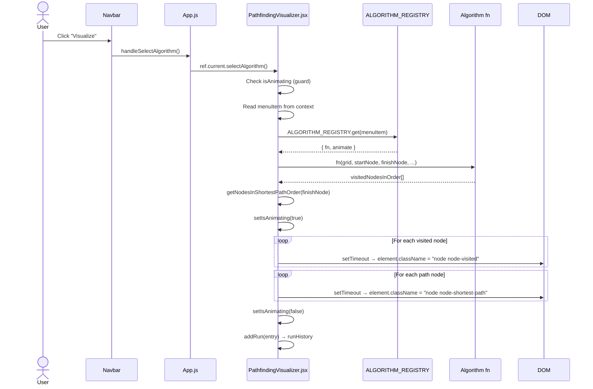
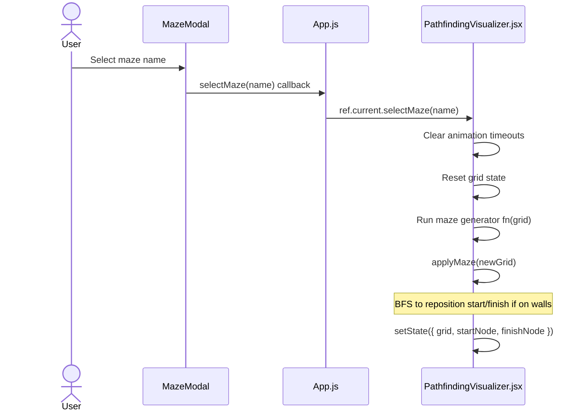

# API Workflows

## Purpose
Document all entry points, workflows, and data contracts within the Pathfinding Visualizer. This application has no HTTP API; entry points are React component methods and context hooks.

## Scope
`src/PathfindingVisualizer/PathfindingVisualizer.jsx` (public methods), `src/Components/MenuItemContext.js` (context API), `src/Components/Navbar.jsx` (user action triggers).

---

## Current Implementation Details

There are no REST, GraphQL, or WebSocket endpoints. The "API" is the interface between `App.js` (via a forwarded ref) and `PathfindingVisualizer.jsx`, plus the React context API exposed by `MenuItemContext.js`.

---

## Public Method API — `PathfindingVisualizer` Class

Accessed via `pathfindingVisualizerRef.current` in `App.js`.

### `selectAlgorithm()`
- **Trigger:** User clicks Visualize button in `Navbar.jsx` → `App.js:handleSelectAlgorithm()`.
- **Behaviour:** Reads `this.context.menuItem`, looks up the algorithm in `ALGORITHM_REGISTRY`, runs the algorithm against the current grid, and starts the animation sequence.
- **Validation:** Checks `context.isAnimating` before proceeding. If a gate is placed with a bidirectional algorithm, falls back to direct mode.
- **Error response:** Sets `this.setState({ noPathFound: true })` if no path is returned.

### `selectMaze(name)`
- **Trigger:** User selects a maze in `MazeModal.jsx` → `App.js:handleSelectMaze(name)`.
- **Behaviour:** Clears existing animation, generates the maze on the grid, calls `applyMaze(newGrid)` to reposition start/finish nodes.
- **Validation:** No-op if `name` is `'None'`.

### `clearPath()`
- **Trigger:** User clicks Clear Path in `Navbar.jsx` → `App.js:handleClearPath()`.
- **Behaviour:** Cancels animation timeouts, resets all visited/distance fields on nodes, calls `resetCSS()`.

### `resetGrid()`
- **Trigger:** User clicks Clear Board in `Navbar.jsx` → `App.js:handleResetGrid()`.
- **Behaviour:** Full grid reset — clears walls, weights, gates, and all algorithm state. Calls `resetCSS()`.

---

## Context API — `MenuItemContext.js`

### Hooks

| Hook | Returns | Description |
|---|---|---|
| `useMenuItem()` | `{ menuItem, setMenuItem }` | Currently selected algorithm name |
| `useMazeItem()` | `{ mazeItem, setMazeItem }` | Currently selected maze name |
| `useSpeedItem()` | `{ speedItem, setSpeedItem }` | Animation speed: `'Slow'` or `'Fast'` |
| `useIsAnimating()` | `{ isAnimating, setIsAnimating }` | Whether animation is running |
| `useDrawMode()` | `{ drawMode, setDrawMode }` | Current draw mode: `'wall'`, `'weight'`, `'gate'` |
| `useRunHistory()` | `{ runHistory, addRun }` | History of algorithm runs (max 20) |

---

## Algorithm Registry

Defined in `PathfindingVisualizer.jsx` as `ALGORITHM_REGISTRY` (`Map`).

| Key (algorithm name) | Function | Animation mode |
|---|---|---|
| `"Dijkstra's Algorithm"` | `dijkstra` | `standard` |
| `"Breadth-First Search"` | `bfs` | `standard` |
| `"Depth-First Search"` | `dfs` | `standard` |
| `"A* Search"` | `aStar` | `standard` |
| `"Bellman-Ford"` | `bellmanFord` | `standard` |
| `"Floyd-Warshall"` | `floydWarshall` | `standard` |
| `"Greedy Best-First Search"` | `gbfs` | `standard` |
| `"Bidirectional Search"` | `biDirectionalSearch` | `bidirectional` |
| `"Uniform Cost Search"` | `uniformCostSearch` | `standard` |
| `"Beam Search"` | `beamSearch` | `standard` |
| `"Weighted A*"` | `weightedAStar` | `standard` |
| `"IDA*"` | `idaStar` | `standard` |
| `"Bidirectional A*"` | `bidirectionalAStar` | `bidirectional-astar` |

Animation modes:
- `standard` — single visited array, single path animation.
- `bidirectional` — two visited arrays (start-side and finish-side), merged animation.
- `bidirectional-astar` — uses `getNodesInShortestPathOrderBiAStar` for path reconstruction.

---

## Mermaid Sequence Diagram — Algorithm Execution

---

## Mermaid Sequence Diagram — Maze Generation

---

## Operational Concerns
- All method calls are synchronous except animation, which uses `setTimeout` chains.
- Bidirectional algorithms fall back to direct mode when a gate node is present.

---

## Known Gaps
- No HTTP API contracts.
- `addRun` entry shape is `Needs verification`.
- No throttling or debouncing on mouse-drag wall-drawing events.

---

## Recommended Follow-up Work
- Add throttle/debounce to `handleMouseEnter` for performance on large grids.
- Document exact `addRun` entry shape from all call sites.
