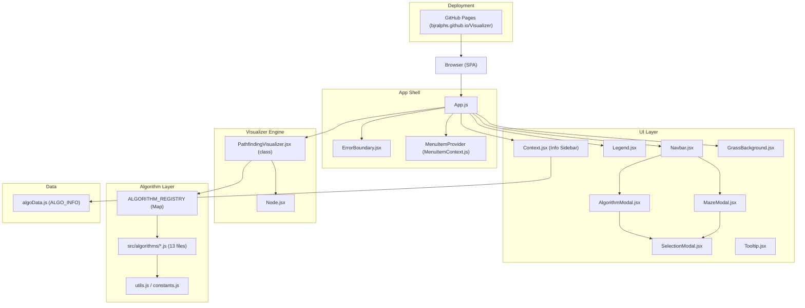

# Architecture

## Purpose
Provide a system-level overview of the Pathfinding Visualizer application for onboarding engineers and maintainers.

## Scope
All source modules under `src/`, the build output under `build/`, and deployment configuration in `package.json`.

---

## System Overview
The Pathfinding Visualizer is a client-side React single-page application (SPA) with no backend, no database, and no authentication layer. Users interact with an in-browser grid, select algorithms and maze patterns, and watch animated pathfinding runs in real time.

---

## Main Components and Layers

| Layer | Files |
|---|---|
| Application shell | `src/App.js`, `src/index.js` |
| Global state / context | `src/Components/MenuItemContext.js` |
| Navigation | `src/Components/Navbar.jsx` |
| Grid and visualizer engine | `src/PathfindingVisualizer/PathfindingVisualizer.jsx` |
| Individual grid cell | `src/PathfindingVisualizer/Node/Node.jsx` |
| Background rendering | `src/PathfindingVisualizer/GrassBackground.jsx` |
| Algorithm implementations | `src/algorithms/*.js` (13 algorithms) |
| Shared algorithm utilities | `src/algorithms/utils.js`, `src/algorithms/constants.js` |
| Information sidebar | `src/Components/Context.jsx`, `src/Components/algoData.js` |
| Modals | `src/Components/AlgorithmModal.jsx`, `src/Components/MazeModal.jsx`, `src/Components/SelectionModal.jsx` |
| UI chrome | `src/Components/Legend.jsx`, `src/Components/Footer.jsx`, `src/Components/Tooltip.jsx` |
| Error boundary | `src/Components/ErrorBoundary.jsx` |

---

## Key Modules

### `src/PathfindingVisualizer/PathfindingVisualizer.jsx`
- Class component; the central engine of the application.
- Owns the grid state (a 2D array of node objects).
- Exposes `selectAlgorithm()`, `selectMaze()`, `clearPath()`, `resetGrid()` via a forwarded ref.
- Registered algorithm → function mapping via `ALGORITHM_REGISTRY` (`Map`).
- Constants: `START_NODE_ROW=10`, `START_NODE_COL=15`, `FINISH_NODE_ROW=10`, `FINISH_NODE_COL=35`, `NODE_WIDTH=25`, `NODE_HEIGHT=25`, `MAX_ROWS=26`, `MAX_COLS=68`.
- Handles responsive grid resizing via `handleResize`.

### `src/Components/MenuItemContext.js`
- Provides four split React contexts (`MenuCtx`, `AnimationCtx`, `DrawModeCtx`, `HistoryCtx`) and a combined `MenuItemContext` for the class component.
- Custom hooks: `useMenuItem`, `useMazeItem`, `useSpeedItem`, `useIsAnimating`, `useDrawMode`, `useRunHistory`.
- `MAX_RUN_HISTORY = 20` entries stored in state.

### `src/algorithms/utils.js`
- `getAllNodes(grid)` — flattens 2D grid to 1D.
- `getUnvisitedNeighbors(node, grid)` — returns unvisited orthogonal neighbours.
- `getNeighbors(node, grid)` — returns all orthogonal neighbours (no filtering).
- `heuristic(nodeA, nodeB)` — Manhattan distance.
- `MinHeap` class — binary min-heap with configurable key function; used by weighted algorithms.

### `src/algorithms/constants.js`
- `WEIGHT_COST = 5` — cost multiplier applied to weighted nodes.

---

## External Dependencies

| Dependency | Version | Purpose |
|---|---|---|
| `react` | ^18.3.1 | UI framework |
| `react-dom` | ^18.3.1 | DOM rendering |
| `react-scripts` | ^5.0.1 | Build toolchain (Create React App; Webpack 5, ESLint 8, Jest 27) |
| `gh-pages` | ^6.3.0 (dev) | GitHub Pages deployment |
| `@testing-library/react` | ^13 (dev) | React Testing Library (explicit devDep; react-scripts@5 nests rather than hoists) |
| `cross-env` | ^10.1.0 (dev) | Cross-platform env vars (retained; used in `predeploy` only) |

There are no API clients, authentication libraries, state management libraries (Redux, MobX), or CSS-in-JS dependencies.

---

## Database Dependencies
None. All application state is held in React component state. No `localStorage` or `sessionStorage` usage was found.

---

## Authentication and Authorization Overview
None. The application is fully public with no user accounts, sessions, or role-based access.

---

## Mermaid Architecture Diagram

---

## Operational Concerns
- `src/serviceWorker.js` has been **deleted** (T06-R1). It was CRA PWA boilerplate that was never registered. The `index.js` import and `unregister()` call were removed alongside it.
- **T12 — React 18 (May 2026):** `src/index.js` now uses `createRoot` from `react-dom/client` (React 18 concurrent API). `ReactDOM.render` in `PathfindingVisualizer.test.jsx` is deprecated but functional; it emits a React 18 warning in test output only and does not affect production.
- **T13 — react-scripts 5 / Webpack 5 (May 2026):** Upgraded from react-scripts 3.1.2 (Webpack 4) to 5.0.1 (Webpack 5). The `--openssl-legacy-provider` Node option is no longer needed. ESLint 8 is bundled; Unicode BOM errors from pre-existing source files are silenced via `"unicode-bom": "off"` in `eslintConfig` in `package.json`.
- **T14 — ARIA / Keyboard (May 2026):** Grid has `role="grid"` / `role="row"` / `role="gridcell"` hierarchy. Each `Node` has `tabIndex={0}`, `aria-label` (including node state), and a `handleKeyDown` handler for Space/Enter. Focus ring via `.node:focus-visible`. `aria-pressed` was intentionally omitted — it is invalid on `role="gridcell"` per ARIA spec.
- **T15 — Touch / Mobile (May 2026):** `onTouchStart` is handled per `Node`; `onTouchMove` and `onTouchEnd` are handled on the `.grid` container div. `handleTouchMove` uses `document.elementFromPoint` to resolve the node under the finger and delegates to `handleMouseEnter`. `touch-action: none` on `.grid` prevents browser scroll interception during drawing.
- **CI (May 2026):** `.github/workflows/ci.yml` runs `npm test` + `npm run build` on every push and PR. `.github/workflows/deploy.yml` updated: Node 20 LTS, removed stale `--openssl-legacy-provider`, added test step before deploy.
- **Coverage thresholds (May 2026):** `jest.coverageThreshold` in `package.json` enforces floor of 30–45% globally. `npm run test:coverage` produces a text + lcov report.
- **Node 24 compatibility:** A `[DEP0176] fs.F_OK is deprecated` warning is emitted by react-scripts 5.0.1 internals on Node 24. It does not affect the build or runtime.
- The build targets GitHub Pages (`homepage` in `package.json`).
- `NODE_OPTIONS=--openssl-legacy-provider` is required due to a Node.js 17+/Webpack 4 incompatibility. Scripts now use `cross-env` (T07) so they work on Windows, macOS, and Linux.

---

## Known Gaps
- No server-side rendering or API.
- No state persistence across sessions.
- React 16 is end-of-life; class component pattern in `PathfindingVisualizer.jsx` is legacy.
- No error tracking service (e.g., Sentry) is wired up.

---

## Recommended Follow-up Work
- Upgrade to React 18 and refactor `PathfindingVisualizer.jsx` to a functional component with hooks.
- Add error tracking (Sentry or similar) to `ErrorBoundary`.
- Integrate a service worker for offline support.
- Add `eslint` and `prettier` configuration to the project.
