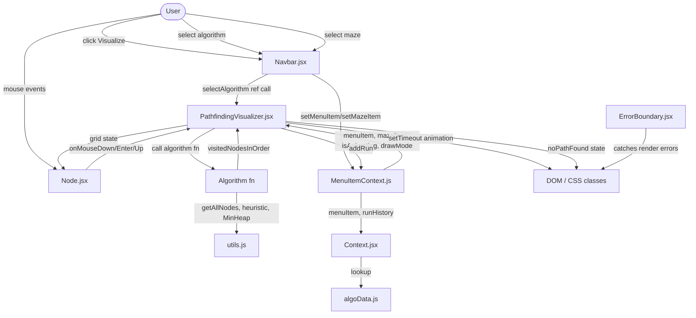

# Data Flow

## Purpose
Document how data enters, moves through, and is transformed within the Pathfinding Visualizer application.

## Scope
All data flows are client-side only. There is no backend, API, or database.

---

## How Data Enters the System

| Entry Point | Source | Description |
|---|---|---|
| Mouse events | User | `onMouseDown`, `onMouseEnter`, `onMouseUp` on `Node.jsx` trigger wall/weight/gate drawing |
| Touch events | User | `onTouchStart` on `Node.jsx`; `onTouchMove`/`onTouchEnd` on the grid div — map to the same drawing logic via `handleTouchStart`, `handleTouchMove`, `handleTouchEnd` (T15) |
| Algorithm selection | User | `AlgorithmModal.jsx` → `MenuItemContext` → `PathfindingVisualizer.jsx` via `selectAlgorithm()` |
| Maze selection | User | `MazeModal.jsx` → `MenuItemContext` → `PathfindingVisualizer.jsx` via `selectMaze()` |
| Speed selection | User | `Navbar.jsx` → `useSpeedItem()` hook → animation delay calculation |
| Draw mode selection | User | `Navbar.jsx` or toolbar → `useDrawMode()` hook → `PathfindingVisualizer.jsx` |
| Window resize | Browser | `window.addEventListener('resize', handleResize)` in `PathfindingVisualizer.jsx` and `App.js` |
| Page load | Browser | `componentDidMount` in `PathfindingVisualizer.jsx` initialises the grid and applies the default maze |

---

## Validation Points
- `handleMouseDown` in `PathfindingVisualizer.jsx` guards against placing walls/weights/gates on `isStart`, `isFinish`, `isGate`, or `isWall` nodes.
- `canGenerateMaze` in `Navbar.jsx` prevents maze generation during animation (`isAnimating === true`).
- `applyMaze` uses a BFS to find the nearest connected open cell, ensuring start and finish nodes are always reachable after maze generation.
- Algorithm entry points guard against null/undefined nodes via the `isWall` check inside each algorithm's loop.
- `context.isAnimating` gate in `handleMouseDown` prevents grid edits during animation.

---

## Movement Between Layers

### Grid Initialisation
```
componentDidMount → getInitialGrid() → this.setState({ grid })
                 → selectMaze(context.mazeItem) → maze generator fn → applyMaze(newGrid)
```

### Algorithm Execution
```
User clicks Visualize
  → Navbar.jsx → App.js:handleSelectAlgorithm()
  → pathfindingVisualizerRef.current.selectAlgorithm()
  → PathfindingVisualizer.jsx:selectAlgorithm()
  → ALGORITHM_REGISTRY.get(menuItem).fn(grid, startNode, finishNode, ...)
  → returns visitedNodesInOrder[]
  → animateAlgorithm(visitedNodesInOrder) → setTimeout chain
  → DOM class updates: node-visited, node-shortest-path
  → addRun(entry) → HistoryCtx (run history)
```

### Drawing Walls / Weights / Gates
```
onMouseDown(row, col) or onTouchStart(row, col)  ← T15: touch mirrors mouse
  → PathfindingVisualizer.jsx:handleMouseDown() / handleTouchStart()
  → getNewGridWithWallToggled(grid, row, col) | getNewGridWithWeightToggled | getNewGridWithGateToggled
  → this.setState({ grid: newGrid })
  → Node.jsx re-renders via React.memo

onTouchMove (fires on .grid div, not per-Node)   ← T15: elementFromPoint maps touch to node
  → document.elementFromPoint(touch.clientX, touch.clientY)
  → parse id="node-{row}-{col}" → handleMouseEnter(row, col)
```
```

### Drag-and-Drop (Start / Finish / Gate nodes)
```
onMouseDown → setState({ draggingNode: 'start'|'finish'|'gate' })
onMouseEnter(row, col) → handleMouseEnter() → getNewGridWithNodeMoved()
onMouseUp → setState({ draggingNode: null })
```

### Info Sidebar
```
MenuItemContext:menuItem changes
  → Context.jsx:useMenuItem() re-renders
  → ALGO_INFO[menuItem] lookup in algoData.js
  → display algorithm metadata (complexity, origin, description)
```

---

## Transformations

| Transformation | Location | Input | Output |
|---|---|---|---|
| 2D grid → 1D array | `utils.js:getAllNodes` | `node[][]` | `node[]` |
| Grid node → wall toggle | `PathfindingVisualizer.jsx:getNewGridWithWallToggled` | `grid, row, col` | new `grid` with `isWall` toggled |
| Grid node → weight toggle | `getNewGridWithWeightToggled` | `grid, row, col` | new `grid` with `isWeight` toggled |
| Grid node → gate placement | `getNewGridWithGateToggled` | `grid, row, col` | new `grid` with `isGate` toggled |
| Visited nodes → shortest path | `getNodesInShortestPathOrder` (dijkstra.js, others) | `finishNode` | `node[]` path via `previousNode` chain |
| Node cost with weight | `constants.js:WEIGHT_COST=5` | node | cost `× 5` when `isWeight === true` |
| Window dimensions → grid size | `handleResize` | `window.innerWidth/Height` | `numRows`, `numCols` |
| CSS class assignment | `resetCSS`, animation loop | node state | DOM className update |

---

## Logging Points
- `ErrorBoundary.jsx:componentDidCatch` logs `console.error('ErrorBoundary caught:', error, info.componentStack)`.
- No other structured logging is present in the codebase.

---

## Error Points
- If no path exists, `PathfindingVisualizer.jsx` sets `noPathFound: true` and displays a "No path found" indicator.
- `ErrorBoundary.jsx` wraps the entire app; any unhandled render error shows a fallback UI.
- Maze generation may produce isolated start/finish nodes; `applyMaze` resolves this via BFS relocation.

---

## Mermaid Data-Flow Diagram



---

## Operational Concerns
- All state is ephemeral; a page refresh clears the grid.
- Animation is driven by `setTimeout` chains stored in `this.animationTimeouts[]`. If the component unmounts mid-animation, `componentWillUnmount` clears all pending timeouts.

---

## Known Gaps
- No data persistence (no `localStorage`, no backend).
- No structured logging or telemetry.
- No input sanitisation beyond grid-boundary guards (no user-supplied text input exists).

---

## Recommended Follow-up Work
- Add run telemetry (steps visited, path length, time elapsed) to the run history panel.
- Expose algorithm performance metrics in the `Context.jsx` sidebar.
