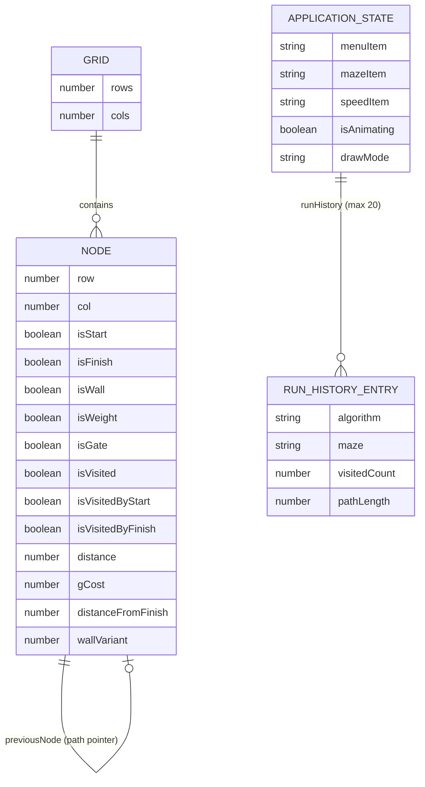

# Entity-Relationship Diagram

## Purpose
Document the in-memory data structures used by the Pathfinding Visualizer. There is no persistent database; all entities exist as JavaScript objects in React state.

## Scope
`src/PathfindingVisualizer/PathfindingVisualizer.jsx` (grid and node state), `src/Components/MenuItemContext.js` (application state).

---

## Current Implementation Details

The application has no database, ORM, or SQL schema. The "entities" below are runtime JavaScript objects managed in React state.

---

### Entity: Node

Defined and initialised in `PathfindingVisualizer.jsx` inside `getInitialGrid()` / `createNode()`.

| Field | Type | Description |
|---|---|---|
| `row` | `number` | Row index in the grid (0-based) |
| `col` | `number` | Column index in the grid (0-based) |
| `isStart` | `boolean` | Whether this node is the start node |
| `isFinish` | `boolean` | Whether this node is the finish node |
| `isWall` | `boolean` | Whether this node is a wall (impassable) |
| `isWeight` | `boolean` | Whether this node has extra traversal cost |
| `isGate` | `boolean` | Whether this node is a gate (intermediate waypoint) |
| `isVisited` | `boolean` | Visited flag used by algorithms |
| `isVisitedByStart` | `boolean` | Visited from start side (bidirectional algorithms) |
| `isVisitedByFinish` | `boolean` | Visited from finish side (bidirectional algorithms) |
| `distance` | `number` | Shortest known distance from start (`Infinity` initially) |
| `gCost` | `number` | g-cost used by A* variants (`Infinity` initially) |
| `distanceFromFinish` | `number` | Distance from finish (bidirectional / heuristic algorithms) |
| `previousNode` | `Node \| null` | Pointer used to reconstruct the shortest path |
| `wallVariant` | `number` | Visual variant index (0–4) for wall sprite selection |

---

### Entity: Grid

| Field | Type | Description |
|---|---|---|
| `grid` | `Node[][]` | 2D array; rows × cols, up to `MAX_ROWS=26` × `MAX_COLS=68` |

---

### Entity: RunHistoryEntry

Stored in `MenuItemContext.js` via `addRun(entry)`. Up to `MAX_RUN_HISTORY=20` entries.

| Field | Type | Description |
|---|---|---|
| `algorithm` | `string` | Algorithm name (e.g., `"A* Search"`) |
| `maze` | `string` | Maze name at time of run |
| `visitedCount` | `number` | `Needs verification` — exact fields added by `addRun` caller |
| `pathLength` | `number` | `Needs verification` |
| `timestamp` | `Date \| string` | `Needs verification` |

---

### Entity: ApplicationState (MenuItemContext)

| Field | Type | Description |
|---|---|---|
| `menuItem` | `string` | Currently selected algorithm name |
| `mazeItem` | `string` | Currently selected maze name |
| `speedItem` | `string` | `'Slow'` or `'Fast'` |
| `isAnimating` | `boolean` | Whether an animation is currently running |
| `drawMode` | `string` | `'wall'`, `'weight'`, or `'gate'` |
| `runHistory` | `RunHistoryEntry[]` | Last N algorithm runs |

---

## Mermaid ER Diagram

---

## Operational Concerns
- All entities are destroyed on page refresh. There is no persistence mechanism.
- Grid size changes on window resize, which destroys all current node state.

---

## Known Gaps
- `RunHistoryEntry` fields beyond `algorithm` and `maze` are `Needs verification` — the exact object shape passed to `addRun()` in `PathfindingVisualizer.jsx` was not fully inspected.
- No foreign key or referential integrity — this is enforced only by algorithm logic.

---

## Recommended Follow-up Work
- Verify exact `RunHistoryEntry` shape by inspecting all `addRun(...)` call sites in `PathfindingVisualizer.jsx`.
- Consider persisting run history in `localStorage` across sessions.
