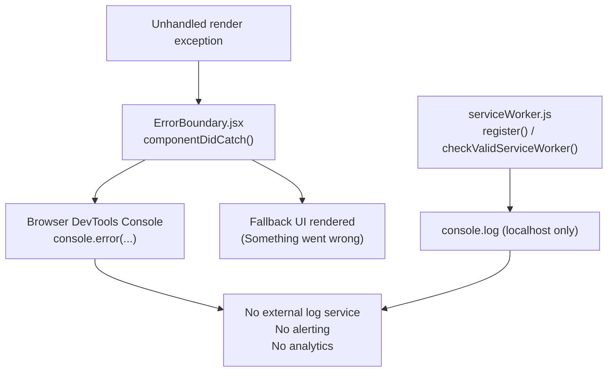

# Logging and Monitoring Flow

## Purpose
Document what is logged, where logs are written, and what monitoring exists for the Pathfinding Visualizer.

## Scope
`src/Components/ErrorBoundary.jsx`, `src/serviceWorker.js`, browser console output.

---

## Current Implementation Details

The application has minimal, informal logging. There is no structured logging library, no log aggregation service, and no external monitoring platform.

---

## What Is Logged

| Event | Location | Severity | Output |
|---|---|---|---|
| Unhandled render error | `ErrorBoundary.jsx:componentDidCatch` | ERROR | `console.error('ErrorBoundary caught:', error, info.componentStack)` |
| Service worker ready (localhost only) | `serviceWorker.js:register` | INFO | `console.log('This web app is being served cache-first...')` |
| Service worker registration failure | `serviceWorker.js:registerValidSW` | `Needs verification` | `Needs verification` |

No algorithm execution, maze generation, user interaction, or performance events are logged.

---

## Where Logs Are Written
All output goes to the browser developer console (`console.error`, `console.log`). No server-side log collection exists.

---

## Severity Levels
No formal severity framework is used. Only `console.error` and `console.log` are present.

---

## Alerting and Monitoring Behaviour
None. There is no error reporting service (e.g., Sentry, Datadog), no uptime monitoring, and no analytics platform wired into the application.

---

## Mermaid Logging / Monitoring Flow

---

## Operational Concerns
- Production errors are invisible to the maintainer unless a user reports them or opens browser DevTools.
- The `ErrorBoundary` only catches React render errors; JavaScript errors inside `setTimeout` animation callbacks are not caught by it.

---

## Known Gaps
- No external error tracking (Sentry, Rollbar, etc.).
- No performance monitoring (Web Vitals, Lighthouse CI).
- No user analytics or feature usage tracking.
- Animation callback errors (`setTimeout`) bypass the `ErrorBoundary`.
- Service worker logging details are `Needs verification`.

---

## Recommended Follow-up Work
- Integrate Sentry (or equivalent) in `ErrorBoundary.componentDidCatch` to capture production errors automatically.
- Wrap animation `setTimeout` callbacks in `try/catch` blocks and report to an error service.
- Add Web Vitals reporting via `src/serviceWorker.js` or `src/index.js`.
