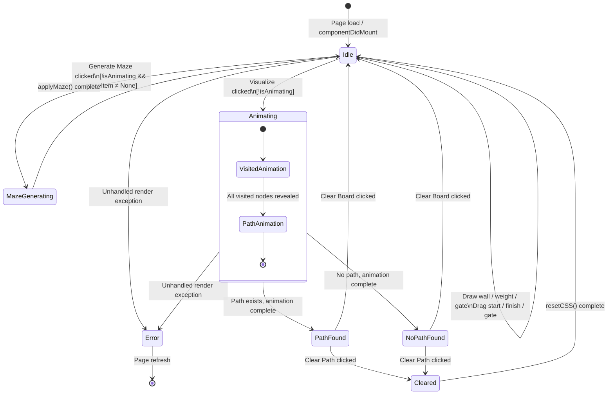

# State-Transition Diagram

## Purpose
Document the valid states of the application and the transitions between them, focusing on the grid and animation lifecycle.

## Scope
`src/PathfindingVisualizer/PathfindingVisualizer.jsx` and `src/Components/MenuItemContext.js`.

---

## Main Workflow States

| State | Description |
|---|---|
| **Idle** | Grid is initialised; no animation running. User can draw walls, weights, gates, drag nodes, select algorithm/maze. |
| **MazeGenerating** | A maze generator is running; grid is being built; animation timeouts are active. |
| **Animating** | A pathfinding algorithm is executing; visited nodes and path are being revealed. `isAnimating === true`. |
| **PathFound** | Animation complete; shortest path is displayed. Grid is read-only until cleared. |
| **NoPathFound** | Animation complete; no path existed. `noPathFound === true`. |
| **Cleared** | User cleared path or reset grid; grid returns to Idle state with walls preserved (Clear Path) or fully reset (Clear Board). |
| **Error** | An unhandled render error occurred; `ErrorBoundary.jsx` shows the fallback UI. |

---

## Valid Transitions

| From | To | Trigger | Guard |
|---|---|---|---|
| Idle | MazeGenerating | User selects a maze and clicks Generate Maze | `!isAnimating`, `mazeItem !== 'None'` |
| MazeGenerating | Idle | `applyMaze` completes; `setState` resolves | — |
| Idle | Animating | User clicks Visualize | `!isAnimating`, algorithm selected |
| Animating | PathFound | Final animation timeout fires; path exists | — |
| Animating | NoPathFound | Algorithm returns empty path | — |
| PathFound | Cleared | User clicks Clear Path | — |
| NoPathFound | Cleared | User clicks Clear Path | — |
| PathFound | Idle | User clicks Clear Board | — |
| NoPathFound | Idle | User clicks Clear Board | — |
| Cleared | Idle | `resetCSS` completes | — |
| Idle | Idle | User draws walls / weights / gates / drags nodes | `!isAnimating` |
| Animating | Idle | `Needs verification` — no cancel/interrupt button observed | — |
| Any | Error | Unhandled render exception | — |
| Error | Idle | User refreshes page | — |

---

## Roles Allowed to Trigger Transitions
The application has no authentication or role system. All transitions are user-triggered (mouse/click). There are no admin-only actions.

---

## Business Rules
1. Grid drawing (walls, weights, gates) is blocked while `isAnimating === true`.
2. The Visualize action is blocked while `isAnimating === true`.
3. Maze generation is blocked while `isAnimating === true` and when `mazeItem === 'None'`.
4. Bidirectional algorithms silently fall back to direct mode when a gate node is present.
5. After a maze is generated, start and finish nodes are always relocated to the nearest open, connected cell via BFS (`applyMaze`).
6. `PATH_STEP_MS = 100` ms between path reveal steps.
7. `ARRIVAL_DURATION_MS = 1500` ms — finish node plays an arrival animation before switching to a looping idle animation.

---

## Mermaid State Diagram

---

## Operational Concerns
- There is currently no way to cancel an in-progress animation without refreshing the page. `Needs verification` — check if Clear Board / Clear Path stops animation mid-run.
- Animation timeouts are stored in `this.animationTimeouts[]` and cleared in `componentWillUnmount` and `resetGrid` / `clearPath`.

---

## Known Gaps
- No mid-animation cancel UI control was observed.
- `isAnimating` state is managed via context, but the timing of when it is set back to `false` after animation should be verified.

---

## Recommended Follow-up Work
- Add a Cancel / Stop animation button.
- Verify that `clearPath` and `resetGrid` reliably cancel active animations and reset `isAnimating` to `false`.
